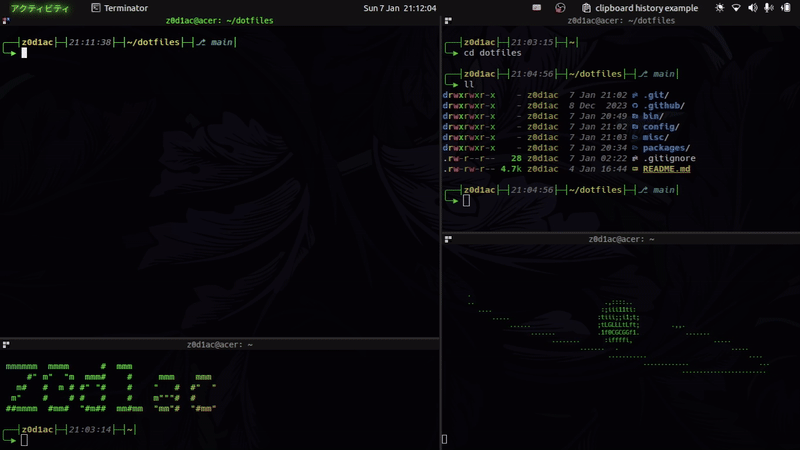

<h1 align="center">Dotfiles</h1>

<div align="center">
    
</div>

## Overview

This repository contains my personal dotfiles,
designed for full use on Ubuntu (Debian-based),
with most of the features also functioning on other Linux distributions.

---

### Installation

Interactive installation with [bin/install.sh]() script.

```bash
git clone https://github.com/migueltc13/dotfiles.git ~/dotfiles
cd ~/dotfiles
bin/install.sh
```

### Update

Interactive update with [bin/update.sh]() script.

```bash
cd ~/dotfiles
bin/update.sh
```

---

### Packages

Package lists, located in [packages/](./packages/).

- [apt.txt](packages/apt.txt) - apt packages
- [apt-lite.txt](packages/apt-lite.txt) - minimal apt packages
- [snap.txt](packages/snap.txt) - snap packages
- [pip.txt](packages/pip.txt) - pip packages
<!-- TODO - [npm-packages.txt](npm-packages.txt) - npm packages -->
<!-- TODO - [gem-packages.txt](gem-packages.txt) - gem packages -->
<!-- TODO - [cargo-packages.txt](cargo-packages.txt) - cargo packages -->

---

### config

Configuration files, located in [config/](./config/).

#### Bash

- [.profile](./config/bash/.profile) - bash profile, used for login shells
- [.bashrc](./config/bash/.bashrc) - main bash config file
- [.bash/prompt.sh](./config/bash/.bash/prompt.sh) - prompt
- [.bash/colors.sh](./config/bash/.bash/colors.sh) - colors
- [.bash/aliases.sh](./config/bash/.bash/aliases.sh) - aliases
- [.bash/functions.sh](./config/bash/.bash/functions.sh) - functions
- [.bash/keybindings.sh](./config/bash/.bash/keybindings.sh) - keybindings
- [.bash/copilot_cli.sh](./config/bash/.bash/copilot_cli.sh) - copilot cli config
- [.bash/fzf.sh](./config/bash/.bash/fzf.sh) - fzf config

#### Neovim

- [nvim/](./config/nvim/) - neovim config dir

#### Tmux

- [tmux/](./config/tmux/) - tmux config dir

#### Bat

- [bat/](./config/bat/) - bat config dir

#### Btop

- [btop/](./config/btop/) - btop config dir

#### Nano

- [nano/.nanorc](./config/nano/.nanorc) - nano config file

#### Terminator

- [terminator/config](./config/terminator/config) - terminator config file

#### XTerm

- [xterm/.Xresources](./config/xterm/.Xresources) - xterm config file

#### Git

- [git/.gitconfig](./config/git/.gitconfig) - git config file

---

### misc

Miscellaneous files, located in [misc/](./misc/).

#### Applications and Icons

Applications located in [misc/applications/](./misc/applications/).

Icons located in [misc/icons/](./misc/icons/).

#### Fonts

Located in [misc/fonts/](./misc/fonts/).

- [Hack](./misc/fonts/Hack.zip) - Hack font
- [Nerd Fonts Symbols](./misc/fonts/NerdFontsSymbolsOnly.zip) - Nerd Fonts symbols only

#### Wallpapers

Located in [misc/wallpapers/](./misc/wallpapers/).

- [wallpapers](./misc/wallpapers/wallpapers/) - wallpapers dir
- [wallpaper.sh](./misc/wallpapers/wallpaper.sh) - script to randomly change wallpaper, used within a cron job
- [wallpaper.log](./misc/wallpapers/wallpaper.log) - log file for `wallpaper.sh` output
- [wallpaper.png](./misc/wallpapers/wallpaper.png) - current wallpaper symlinked

Cron job example:

```bash
# m h   dom mon dow  command
0 * * * *   $HOME/Pictures/Wallpapers/wallpaper.sh &> $HOME/Wallpapers/wallpaper.log
```

#### Animations (ascii)

Located in [misc/animations/](./misc/animations/).

#### Gnome shell extensions

Located in [misc/gnome-extensions/](./misc/gnome-extensions/).

- [activities-text@z0d1ac](./misc/gnome-extensions/activities-text@z0d1ac)
- [blur-my-shell@aunetx](./misc/gnome-extensions/blur-my-shell@aunetx)
- [clipboard-indicator@tudmotu.com](./misc/gnome-extensions/clipboard-indicator@tudmotu.com)
- [CoverflowAltTab@palatis.blogspot.com](./misc/gnome-extensions/CoverflowAltTab@palatis.blogspot.com)
- [custom-accent-colors@demiskp](./misc/gnome-extensions/custom-accent-colors@demiskp)
- [gsconnect@andyholmes.github.io](./misc/gnome-extensions/gsconnect@andyholmes.github.io)
- [hidetopbar@mathieu.bidon.ca](./misc/gnome-extensions/hidetopbar@mathieu.bidon.ca)
- [lockkeys@fawtytoo](./misc/gnome-extensions/lockkeys@fawtytoo)
- [notification-banner-reloaded@marcinjakubowski.github.com](./misc/gnome-extensions/notification-banner-reloaded@marcinjakubowski.github.com/)

#### Bin

Located in [misc/bin/](./misc/bin/).

> Scripts from /usr/local/bin

<!--
#### command-not-found

Located in [misc/command-not-found/](./misc/command-not-found/).

Inspired by Kali Linux command-not-found script, suggests packages to install
when a command is not found.
-->
<!-- TODO enhance usr/lib/command-not-found script -->
